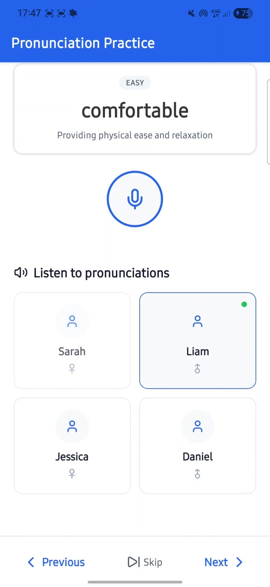

# AI-Powered English Vocabulary Learning App

Learn English vocabulary interactively with AI avatars, pronunciation scoring, and personalized word practice.

---

## Table of Contents

- [Features](#features)
- [Demo](#demo)
- [Technologies Used](#technologies-used)
- [Installation](#installation)
- [Usage](#usage)
- [Environment Variables](#environment-variables)

---

## Screenshots




---
## Features

- Browse and learn new English vocabulary with definitions.
- 🧑‍🏫**Text-to-Speech Avatars**: Generate AI-powered avatar videos that pronounce words.
-  🎤**Pronunciation Scoring**: Record your voice and get instant feedback on pronunciation accuracy.
- Next/Previous word navigation with cached video playback for already generated words.
- Track your learning progress with difficulty badges.
- Smooth, mobile-friendly interface built with **React Native** and **Expo**.

---

## Demo

- Home screen showing word, definition, and difficulty badge.
- Speak Word button generating avatar video.
- Pronunciation scoring with dynamic feedback (color-coded for performance).
  


---

## Technologies Used

- **React Native & Expo** – Cross-platform mobile development.
- **TypeScript** – Type safety for better developer experience.
- **Expo AV** – Video and audio handling.
- **SpeechAce API** – Pronunciation scoring.
- **Heygen API** – AI-generated avatar videos.
- **ElevenLabs API** - AI-generated voices
- **React Navigation** – Screen navigation.
- **Async Storage / FileSystem** – Caching videos locally.

---

## Installation

1. Clone the repository:

```bash
   git clone https://github.com/hcatakli/Lavatar.git
```
2. Install dependencies:

   ```bash
   npm install
   # or
   yarn install
   ```
3. Set up environment variables (see [Environment Variables](#environment-variables))
4. Start the app:

```bash
   npx expo start
```

---
## Usage

- Navigate through words using Next and Previous buttons.
- Press Speak Word to generate or play the avatar video for the current word.
- Press the microphone button to record your pronunciation.
- Receive instant feedback with a color-coded score for your pronunciation.
- Videos of previously generated words are cached and played automatically.

---

## Environment Variables
1. Create a .env file at the root of the project:

```bash
   HEYGEN_API_KEY=your_heygen_api_key
   SPEECHACE_API_KEY=your_speechace_api_key
   ELEVEN_API_KEY=your_eleven_labs_api_key
```

2. Then import in your code using:

```bash
   import { HEYGEN_API_KEY, SPEECHACE_API_KEY } from '@env';
```

